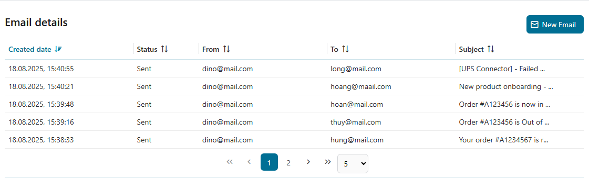
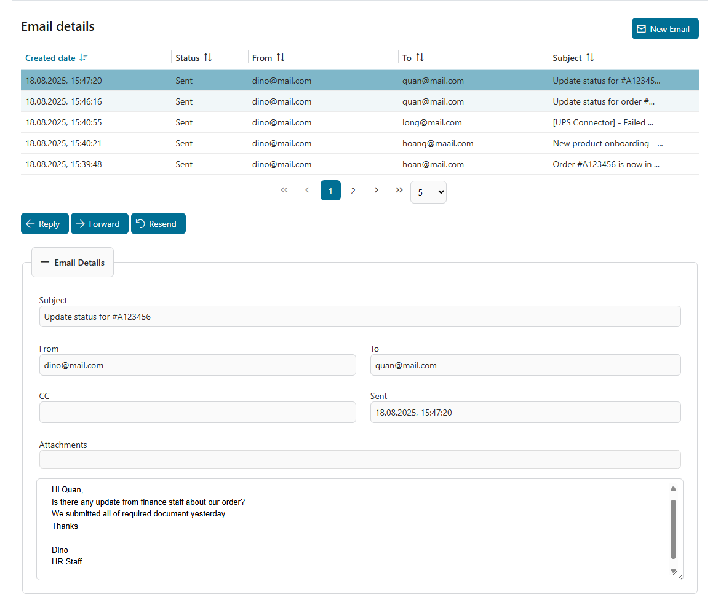
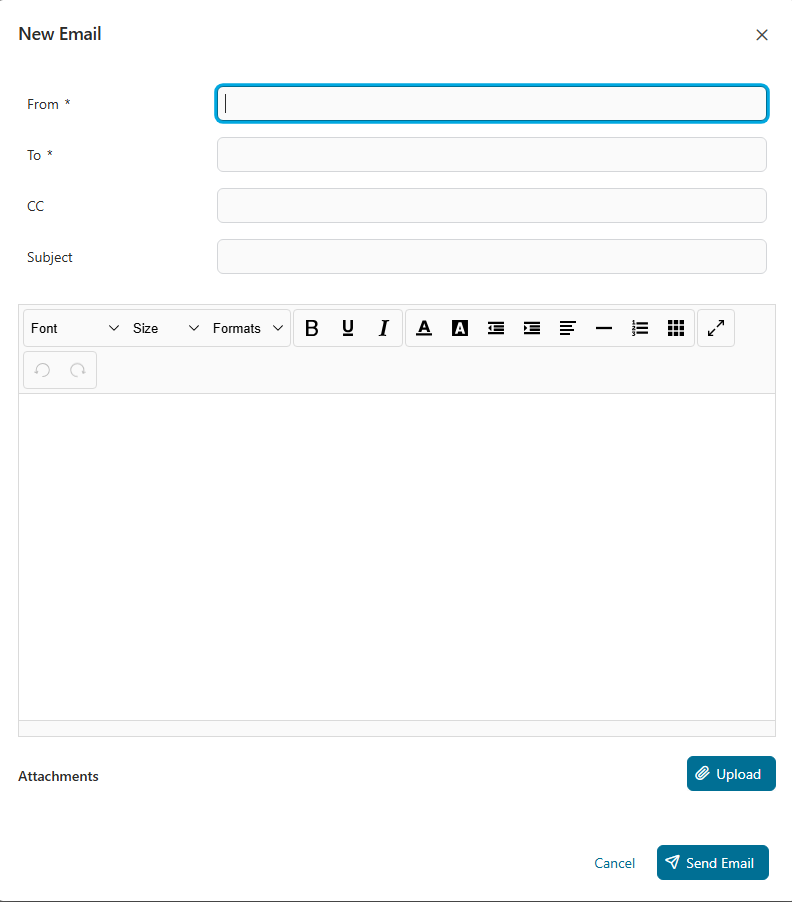
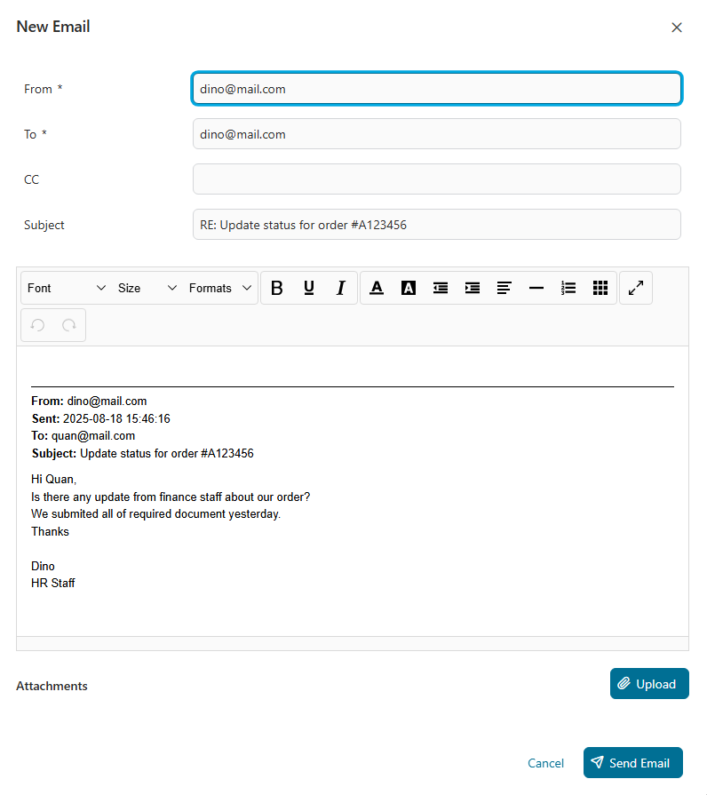
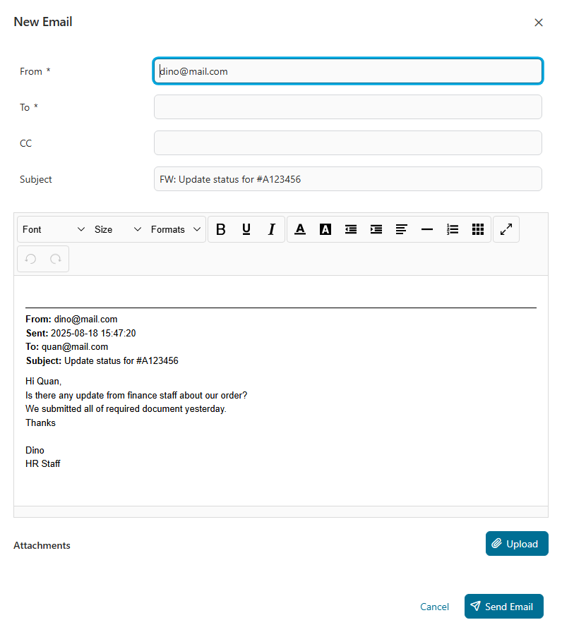
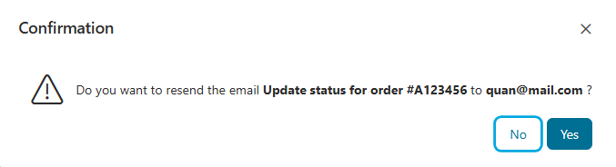
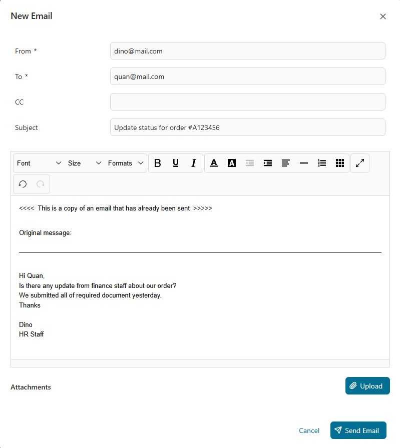
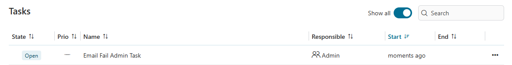
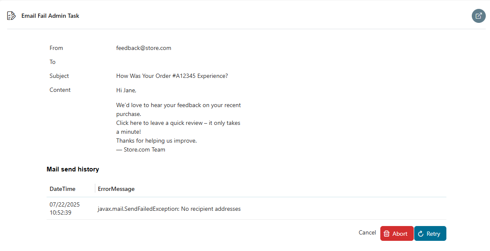

# Case Mail Component

A simple mail component designed to send and receive emails related to a specific Ivy case. All sent emails are automatically linked to their corresponding case, providing seamless tracking and management of communication within the workflow.

The Case Mail Component allows sending, receiving, replying, forwarding, and resending emails linked to an Ivy case.
- A email list view displays key details like date, sender, recipient, and subject.
- Detailed email views and process integration ensure seamless communication tracking.
- It supports field validation, error handling with retry logic, and admin task management for failed emails.
- Original message content and attachments are preserved in replies, forwards, and resends.

## Demo
### Email List View
Displays a list of all emails




### Email Details View
Full details of a selected email




### New Email
- Allows composing and sending new emails.
- Field validations:
  - `From`: Required; must be a valid email address.
  - `To`: Required; must be a valid list of email addresses.
  - `CC`: Optional; if provided, must be a valid list of email addresses.
  
 


### Reply Email
Automatically populates fields based on the original email:
  - `Subject`: Prefixed with `RE:`
  - `Body`:
    ```
    <new message>

    From: <original from>
    Sent: <original sent date>
    To: <original to>
    CC: <original cc>
    Subject: <original subject>
    <original body>
    ```
    



### Forward Email
Used to forward received messages:
  - `From`: Original sender.
  - `To`: User-defined.
  - `Subject`: Prefixed with `FW:`
  - `Body` includes full original message details.
  - Attachments: Original attachments are included.
  


### Resend Email
- Available only for emails in `Sent` state.
- Used to resend a previously sent email:
  - `From`, `To`, `Subject`: Same as the original.
  - `Body`:
    ```
    <<<<  This is a copy of an email that has already been sent  >>>>>

    Original message:
    <original body>
    ```
  - Attachments: Original attachments are included.
  





### Error Handling
- Automatic retry mechanism:
  - Retries `x` times every `y` seconds, configurable via variable:
    - `mailLoopRepeatNumber`
    - `mailLoopRepeatDelay`
- If all retries fail, an admin task is created.

### Admin Tasks
- **Abort:** Cancels the task and ends the process.
- **Retry:** Attempts to send the email again.
If it fails, retries based on the configured retry logic and generates another admin task if needed.





### Received Mail
Retrieves all mails from the mailbox whose subject matches the pattern defined in the `subjectMatches` variable.

If the mail contains a valid case reference in the subject (as defined in the `caseReferenceRegex` variable), it is moved to the `processedFolderName` folder; otherwise, it is moved to the `errorFolderName` folder.

After the email is processed, a task is created for user with Role defined in the `retrieveMailTaskRole` variable.

## Setup

## Configuration
1. Configure Maximum Request Body Size

   Set the maximum size (in bytes) of the request body that the server should buffer/save during:
   - FORM or CLIENT-CERT authentication
   - HTTP/1.1 upgrade requests

   **How to configure:**
   - In `ivy.yaml`:  
     ```yaml
     Http:
       MaxPostSize: 2097152
     ```  
     👉 Reference: [Axon Ivy Docs – ivy.yaml](https://developer.axonivy.com/doc/13.2.0/engine-guide/configuration/files/ivy-yaml.html)

   - In **nginx** configuration:  
     ```nginx
     client_max_body_size 150M;
     ```

2. Set the following variables in your project:
```
@variables.yaml@
```

3. Set up folders in your mailbox

	If you are using the received mail feature, create two folders in your mailbox as configured in the `processedFolderName` and `errorFolderName` variables
	
	
## Guide — Received mail and case assignment

This section helps you understand how incoming emails are linked to cases and how to adapt the component to your project.

#### How the case reference is stored

It is a **persistent field** on the Mail entity: the value returned by the reference extraction logic is stored in the `caseId` field of the `Mail` business data object. Mails are stored in the Axon Ivy repository (database) and are linked to cases only by this string. The MailBrowser (and any logic that lists mails per case) filters Mail entities by this `caseId` value.

#### What you need for emails to show up on a case

1. **Subject format** — The email subject must contain text that matches `caseReferenceRegex`, with the **first capture group** (or your custom logic) defining the case identifier. Example: with `caseReferenceRegex: \[Ref=(.+?)\]`, a subject like `Re: Invoice [Ref=C-2025-01]` yields `C-2025-01`, which is stored in the Mail’s `caseId` field by default.

2. **Case UI** — In the process or page where you show emails for a case, use the **MailBrowser** component and pass the **same identifier** as the `caseId` attribute (e.g. `caseId="#{data.caseId}"`). The MailBrowser lists mails where `Mail.caseId` equals that value, so the identifier you pass must match what is stored when the email was retrieved.

#### Where imported emails are stored and how they are linked

- **Storage:** Imported emails are stored as **Mail** business data entities in the **Axon Ivy repository**. Attachments are stored as **Attachment** entities with a `mailId` reference to the Mail. The original message can also be stored as an attachment (e.g. `.eml`).

- **Linking:** There is no direct reference to an Ivy case or process (no foreign key to `ICase`). The link is by **string match**: each Mail has a **`caseId`** field set to the value returned when the email was processed. When you open a case screen and pass that same value to the MailBrowser’s `caseId` attribute, the component queries Mails by `caseId`, so the emails appear as belonging to that case.

#### When there is no case yet with the extracted reference

If no valid reference is found, the email will then be treated as “no reference” (moved to error folder, notification for unclear mail)

---

#### Customizing how the case reference is extracted:

By default, the component uses the **first capture group** of `caseReferenceRegex` on the email subject as the case identifier and stores it in `Mail.caseId`. If your cases are identified by a different scheme (e.g. internal UUID, or a code that must be looked up), you can **override the method `getReferenceCaseId`** in a custom email handler.

**What `getReferenceCaseId` does**

- **Signature:** `protected String getReferenceCaseId(String subject)`
- **Input:** The email subject line.
- **Output:** The string to store in `Mail.caseId`. This is the value used to link the email to a case in the MailBrowser. Return `null` (or a blank string) if no valid reference is found; the email will then be treated as “no reference”.

**Default behavior** (in `AbstractEmailHandler`): Compiles `caseReferenceRegex` from variables, matches it against the subject (case-insensitive), and returns the first capture group (e.g. `C-2025-01` from `[Ref=C-2025-01]`).

**Custom behavior examples**

- **Return a human-readable code:** Keep the default or return the regex capture group as-is; use the same code in the MailBrowser `caseId` (e.g. `data.caseId` = case code).
- **Return the internal case UUID:** In your handler, use the regex to get the code from the subject, look up your case (e.g. by business code) in the repository, and return the case’s internal id. Then pass that same id to the MailBrowser (e.g. `caseId="#{ivy.case.getId()}"` or your case’s id field).
- **Validate that the case exists:** Look up the case by the extracted code; if not found, return `null` so the email is handled as “no reference” and a user can process it manually.

**Steps to use a custom `getReferenceCaseId`**

1. **Create a custom email handler**  
   Add a class that extends `AbstractEmailHandler` and override `getReferenceCaseId(String subject)`
   
   Reference: `CustomEmailHandler` in case-mail-component-connector-demo


2. **Create a custom handler creator**  
   Add a class that extends `AbstractEmailHandlerCreator` and returns your handler
   
   Reference: `CustomEmailHandlerCreator` in case-mail-component-connector-demo

3. **Use your creator when retrieving mails**  
   The retrieve-mail flow uses `AbstractEmailHandlerCreator` to obtain the handler. To use your implementation you must **override the HandleRetrieveMail process** in your project so that it instantiates your creator instead of the default one. In the script that runs before calling retrieve logic, use:

   ```java
   AbstractEmailHandlerCreator emailHandlerCreator = new CustomEmailHandlerCreator();
   emailHandlerCreator.retrieveEmails(in.storeName);
   ```

   (The default process uses `DefaultEmailHandlerCreator` and `DefaultEmailHandler`; your override replaces this with `CustomEmailHandlerCreator` and `CustomEmailHandler`.)

After that, every retrieved email will use your `getReferenceCaseId` logic. Ensure the value you return is exactly what you pass as `caseId` to the MailBrowser on the case screen, so that emails appear under the correct case.