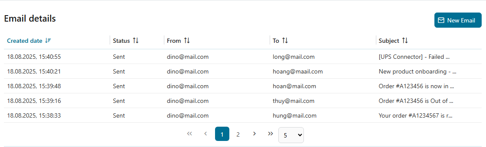
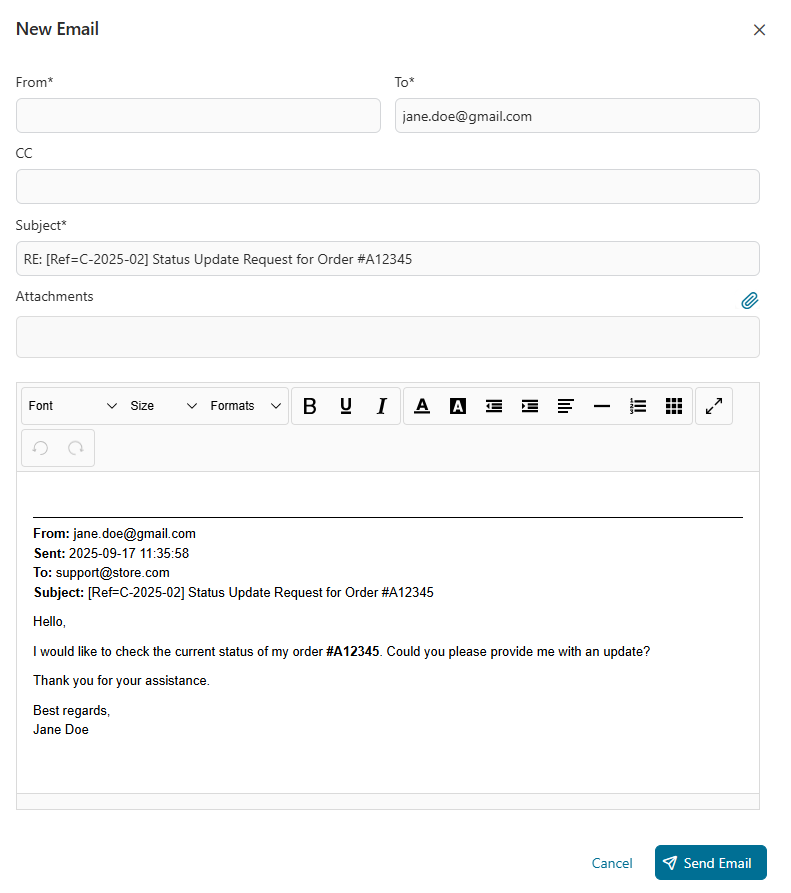
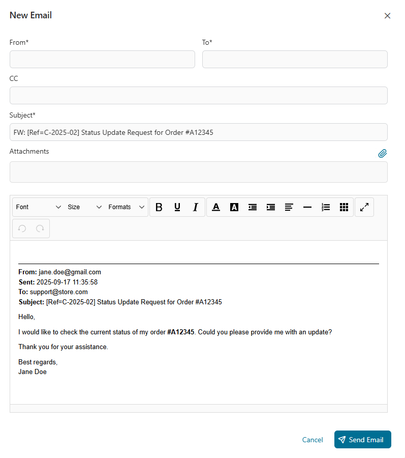

# Fall Post Komponente

Eine simple Post Komponente gestaltet zu senden und empfangen #Email erzählt zu
einem spezifischen Efeu Fall. Alle #hingerissen #Email sind automatisch zu ihrem
#entsprechend Fall verbunden, versehend nahtlos #rückverfolgen und Management
von Kommunikation #innerhalb die workflow.

Die Fall Post Komponente erlaubt senden, Empfang, Antwort, Nachsendung, und
resending #Email verbanden zu einen Efeu Fall.
- Eine #Email Liste Ausblick Displays wesentliche Details gleichnamiges Datum,
  Absender, Empfänger, und dienstbar.
- Detaillierte #Email Ausblicke und Arbeitsgang Integration sichert nahtlose
  Kommunikation #rückverfolgen.
- Es unterstützt Feld Bestätigung, Fehler bedienen mit Wiederholung Logik, und
  admin Task Management für #verkracht #Email.
- Originaler Meldung Inhalt und Anfügungen sind bewahrt in Beantwortungen,
  Stürmer, und resends.

## Demo
### #Email Liste Ausblick
Zeigt eine Liste von alle #Email




### #Mailen #Zuweisen Schau an
Volle Details von einer exklusiven #Email


### Neue #Email
- Erlaubt #abfassen und sendend neue #Email.
- Feld Bestätigungen:
  - `Von`: Bedürft; Müssen sein eine gültige #Email Adresse.
  - `Zu`: Bedürft; Müssen sein eine gültige Liste von #mailen adressiert.
  - `#CC`: Optional; Ob versehen, müssen sein eine gültige Liste von #mailen
    adressiert.


### #Erwidern #Mailen
Automatisch bevölkert #auffangen gegründet auf der originalen #Email:
  - `Dienstbar`: Vorangestellt mit `RE:`
  - `Körper`:
    ```
    <new message>

    From: <original from>
    Sent: <original sent date>
    To: <original to>
    CC: <original cc>
    Subject: <original subject>
    <original body>
    ```




### #Nachschicken #Mailen
Benutzt zu #nachschicken anerkannte Meldungen:
  - `Von`: Originaler Absender.
  - `Zu`: Nutzer-#abgesteckt.
  - `Dienstbar`: Vorangestellt mit `FW:`
  - `Körper` schließt ein volle Original Meldung Details.
  - Anfügungen: Originale Anfügungen sind eingeschlossen.



### Resend #Email
- Nur verfügbar für #Email herein `Gesandt` Staat.
- Benutzt zu resend eine vorher #hingerissen #Email:
  - `Von`, `Zu`, `Dienstbar`: Gleich da das Original.
  - `Körper`:
    ```
    <<<<  This is a copy of an email that has already been sent  >>>>>

    Original message:
    <original body>
    ```
  - Anfügungen: Originale Anfügungen sind eingeschlossen.


### Fehler Handing
- Automatischer Wiederholung Mechanismus:
  - Wiederholungen `x` Zeiten #jede `y` Sekunden, konfigurierbar via variabel:
    - `mailLoopRepeatNumber`
    - `mailLoopRepeatDelay`
- Ob alle Wiederholungen scheitern, #ein admin Task ist geschafft.

### Admin Tasks
- **Treiben ab:** Streicht den Task und endet den Arbeitsgang.
- **Wiederholung:** Versuche zu senden nochmal die #Email. Ob ihm scheitert,
  Wiederholungen gegründet weiter die konfiguriert Wiederholung Logik und
  generiert #andere admin Task #erforderlichenfalls.


### Anerkannte Post
#Wiedergewinnen alle #Post von dem Briefkasten wessen unterwirft Wettkämpfe das
Muster definiert herein das `subjectMatches` Variable.

Ob die Post zügelt einen gültigen Fall Verweis in dem Sujet (da definiert herein
dem `caseReferenceRegex` Variable), es ist begeben zu die `processedFolderName`
Ordner; Andernfalls, es ist begeben zu das `errorFolderName` Ordner.

Nach der #Email ist verarbeitet, ein Task ist geschafft für Nutzer mit Rolle
definiert herein die `retrieveMailTaskRole` Variable.

## Einrichtung
1. Konfigurier #Höchster Bitte Körper Größe

   Gesetzt die #höchster Größe (#in Byte) von den Bitte Körper dass den Server
   sollte Pufferspeicher/speichert während:
   - FORM oder KUNDE-CERT Authentifizierung
   - HTTP/1.1 #aktualisieren #auffordern

   **Wie zu konfigurieren:**
   - Herein `Efeu.yaml`:
     ```yaml
     Http:
       MaxPostSize: 2097152
     ```
     👉 Verweis: [#Axon Efeu Docs –
     Efeu.yaml](https://developer.axonivy.com/doc/12.0/engine-guide/configuration/files/ivy-yaml.html)

   - Herein **nginx** Konfiguration:
     ```nginx
     client_max_body_size 150M;
     ```

2. Gesetzt die folgenden Variablen in eurem Projekt:
```
@variables.yaml@
```

3. Stell auf Ordner in eurem Briefkasten

   Ob du benutzt die anerkannte Post Charakterzug, schaff zwei Ordner in eurem
   Briefkasten konfiguriert da herein dem `processedFolderName` und
   `errorFolderName` Variablen
