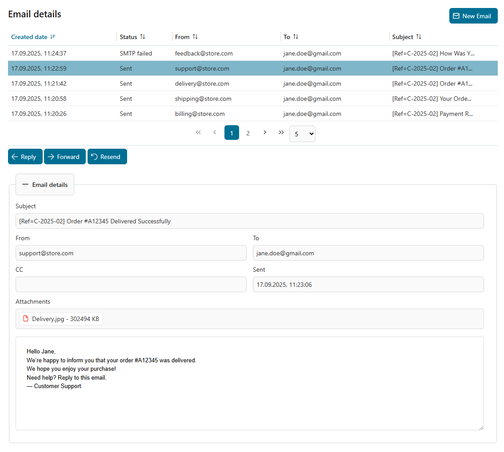
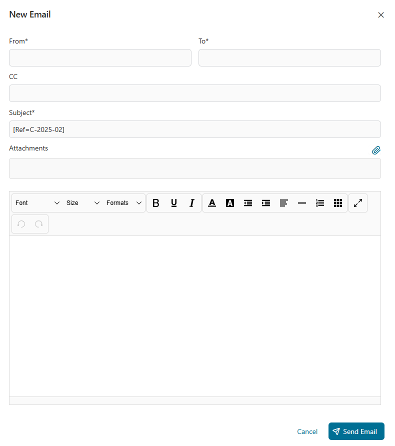
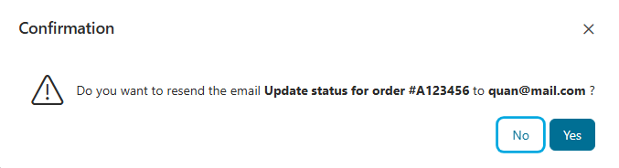
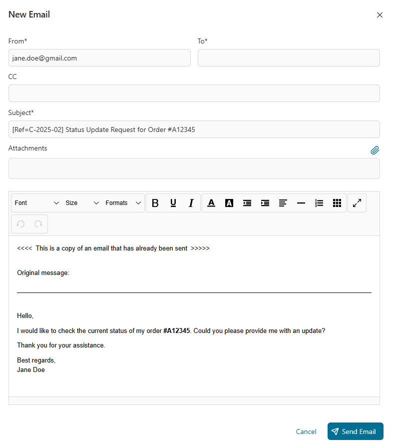
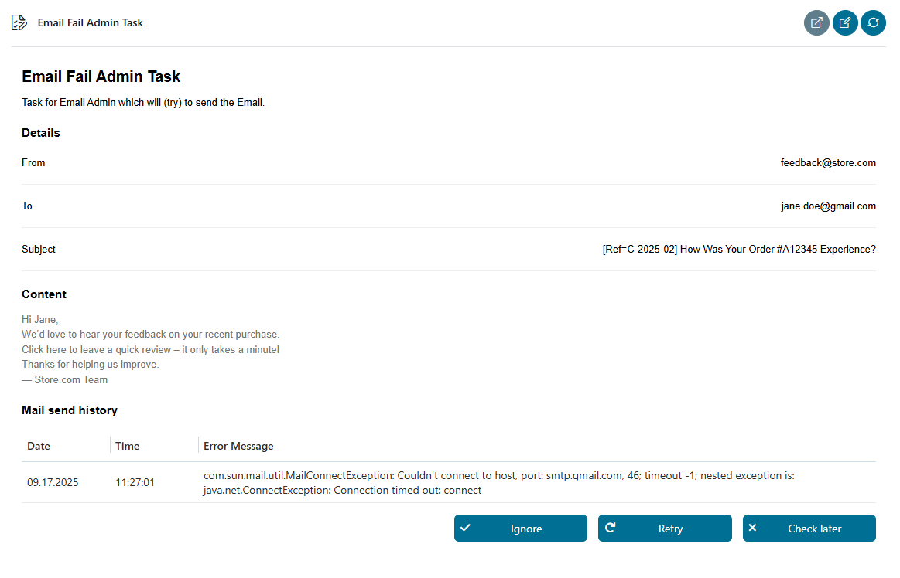

# Fall-Mail-Komponente

Eine einfache E-Mail-Komponente zum Senden und Empfangen von E-Mails zu einem
bestimmten Ivy-Fall. Alle gesendeten E-Mails werden automatisch mit dem
entsprechenden Fall verknüpft, sodass die Kommunikation innerhalb des Workflows
nahtlos verfolgt und verwaltet werden kann.

Die Case Mail-Komponente ermöglicht das Senden, Empfangen, Beantworten,
Weiterleiten und erneute Senden von E-Mails, die mit einem Ivy-Fall verknüpft
sind.
- Eine E-Mail-Listenansicht zeigt wichtige Details wie Datum, Absender,
  Empfänger und Betreff an.
- Detaillierte E-Mail-Ansichten und Prozessintegration gewährleisten eine
  nahtlose Kommunikationsverfolgung.
- Es unterstützt Feldvalidierung, Fehlerbehandlung mit Wiederholungslogik und
  die Verwaltung von Administratoraufgaben für fehlgeschlagene E-Mails.
- Der ursprüngliche Inhalt der Nachricht und die Anhänge bleiben bei Antworten,
  Weiterleitungen und erneuten Sendungen erhalten.

## Demo
### E-Mail-Listenansicht
Zeigt eine Liste aller E-Mails an.


### E-Mail-Details anzeigen
Alle Details zu einer ausgewählten E-Mail




### Neue E-Mail
- Ermöglicht das Verfassen und Versenden neuer E-Mails.
- Feldvalidierungen:
  - `Aus`: Erforderlich; muss eine gültige E-Mail-Adresse sein.
  - `An`: Erforderlich; muss eine gültige Liste von E-Mail-Adressen sein.
  - `CC-`: Optional; falls angegeben, muss es sich um eine gültige Liste von
    E-Mail-Adressen handeln.




### Antwort-E-Mail
Füllt Felder automatisch auf Basis der ursprünglichen E-Mail aus:
  - `Betreff`: Vorangestellt mit `RE:`
  - `Hauptteil`:
    ```
    <new message>

    From: <original from>
    Sent: <original sent date>
    To: <original to>
    CC: <original cc>
    Subject: <original subject>
    <original body>
    ```


### E-Mail weiterleiten
Wird zum Weiterleiten empfangener Nachrichten verwendet:
  - `Von`: Ursprünglicher Absender.
  - `An`: Benutzerdefiniert.
  - `Betreff`: Präfix mit `FW:`
  - `Der Text` enthält die vollständigen Details der Originalnachricht.
  - Anhänge: Die Original-Anhänge sind enthalten.


### E-Mail erneut senden
- `Nur verfügbar für E-Mails im Status „Gesendet“ (Sent) und „` “ (Gesendet,
  aber nicht bestätigt) ( ).
- Wird verwendet, um eine zuvor gesendete E-Mail erneut zu senden:
  - `Von`, `Zu`, `Betreff`: Wie im Original.
  - `Hauptteil`:
    ```
    <<<<  This is a copy of an email that has already been sent  >>>>>

    Original message:
    <original body>
    ```
  - Anhänge: Die Original-Anhänge sind enthalten.






### Fehlerbehandlung
- Automatischer Wiederholungsmechanismus:
  - Wiederholungsversuche `x` Mal alle `y` Sekunden, konfigurierbar über
    Variable:
    - `mailLoopRepeatNumber`
    - `mailLoopRepeatDelay`
- Wenn alle Wiederholungsversuche fehlschlagen, wird eine Admin-Aufgabe
  erstellt.

### Administratoraufgaben
- **Abbrechen:** Bricht die Aufgabe ab und beendet den Prozess.
- **Wiederholen:** Versucht, die E-Mail erneut zu senden. Wenn dies fehlschlägt,
  werden gemäß der konfigurierten Wiederholungslogik weitere Versuche
  unternommen und bei Bedarf eine weitere Administratoraufgabe generiert.




### Erhaltene E-Mail
Ruft alle E-Mails aus dem Postfach ab, deren Betreff mit dem Muster
übereinstimmt, das in der Variablen „ `subjectMatches` ” definiert ist.

Wenn die E-Mail eine gültige Fallreferenz im Betreff enthält (wie in der
Variable „ `caseReferenceRegex”` definiert), wird sie in den Ordner „
`processedFolderName”` verschoben; andernfalls wird sie in den Ordner „
`errorFolderName”` verschoben.

Nachdem die E-Mail verarbeitet wurde, wird eine Aufgabe für den Benutzer mit der
Rolle erstellt, die in der Variablen „ `retrieveMailTaskRole` ” definiert ist.

## Setup
1. Maximale Größe des Request-Body konfigurieren

   Legen Sie die maximale Größe (in Byte) des Request-Body fest, den der Server
   währenddessen puffern/speichern soll:
   - FORM- oder CLIENT-CERT-Authentifizierung
   - HTTP/1.1-Upgrade-Anfragen

   **So konfigurieren Sie:**
   - In `ivy.yaml`:
     ```yaml
     Http:
       MaxPostSize: 2097152
     ```
     👉 Referenz: [Axon Ivy Docs –
     ivy.yaml](https://developer.axonivy.com/doc/12.0/engine-guide/configuration/files/ivy-yaml.html)

   - In der Konfiguration „ **“ von Nginx „** “:
     ```nginx
     client_max_body_size 150M;
     ```

2. Legen Sie die folgenden Variablen in Ihrem Projekt fest:
```
@variables.yaml@
```

3. Richten Sie Ordner in Ihrem Postfach ein.

   `Wenn Sie die Funktion „Empfangene E-Mails” verwenden, erstellen Sie zwei
   Ordner in Ihrem Postfach, wie in den Variablen „ `”, „processedFolderName” (`
   ) und „errorFolderName” (` ) konfiguriert.
