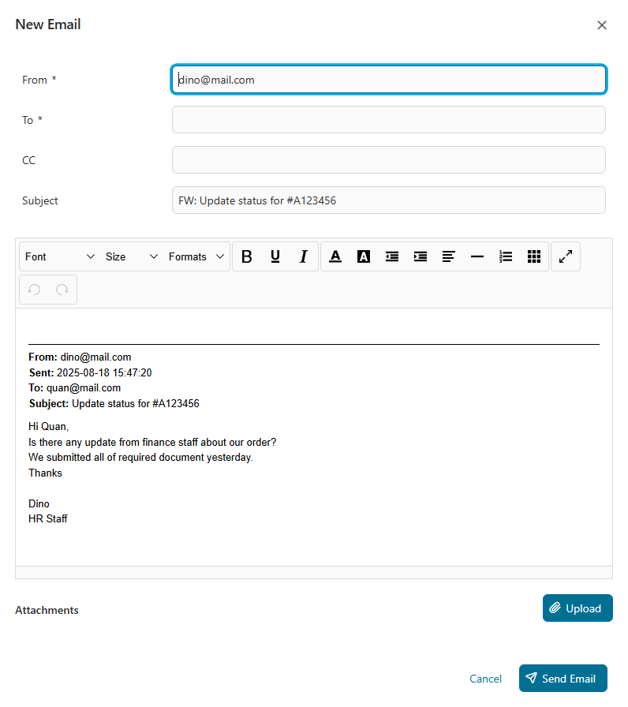
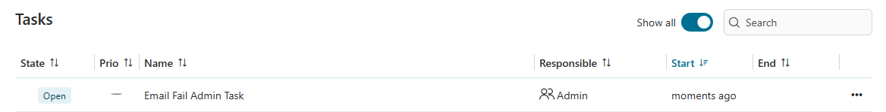
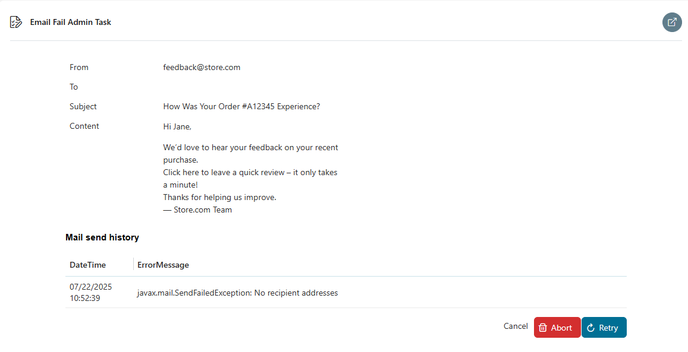

# Mail connector

A simple mail component designed to send and receive emails related to a specific Ivy case. All sent emails are automatically linked to their corresponding case, providing seamless tracking and management of communication within the workflow.

The Mail Connector allows sending, receiving, replying, forwarding, and resending emails linked to an Ivy case.
- A mail list view displays key details like date, sender, recipient, and subject.
- Detailed mail views and process integration ensure seamless communication tracking.
- It supports field validation, error handling with retry logic, and admin task management for failed mails.
- Original message content and attachments are preserved in replies, forwards, and resends.

## Demo
### Mail List View
Displays a list of all emails


### Mail Details View
Full details of a selected email


### New Mail
- Allows composing and sending new emails.
- Field validations:
  - `From`: Required; must be a valid email address.
  - `To`: Required; must be a valid list of email addresses.
  - `CC`: Optional; if provided, must be a valid list of email addresses.
  
 


### Reply Mail
Automatically populates fields based on the original email:
  - `Subject`: Prefixed with `RE:`
  - `Body`:
    ```
    <new message>

    From: <original from>
    Sent: <original sent date>
    To: <original to>
    CC: <original cc>
    Subject: <original subject>
    <original body>
    ```
    


### Forward Mail
Used to forward received messages:
  - `From`: Original sender.
  - `To`: User-defined.
  - `Subject`: Prefixed with `FW:`
  - `Body` includes full original message details.
  - Attachments: Original attachments are included.
  


### Resend Mail
- Available only for mails in `Sent` state.
- Used to resend a previously sent email:
  - `From`, `To`, `Subject`: Same as the original.
  - `Body`:
    ```
    <<<<  This is a copy of an email that has already been sent  >>>>>

    Original message:
    <original body>
    ```
  - Attachments: Original attachments are included.
  


### Error Handling
- Automatic retry mechanism:
  - Retries `x` times every `y` seconds, configurable via variable:
    - `mailLoopRepeatNumber`
    - `mailLoopRepeatDelay`
- If all retries fail, an admin task is created.

### Admin Tasks
- **Abort:** Cancels the task and ends the process.
- **Retry:** Attempts to send the email again.
If it fails, retries based on the configured retry logic and generates another admin task if needed.






## Setup
1. Configure Maximum Request Body Size

   Set the maximum size (in bytes) of the request body that the server should buffer/save during:
   - FORM or CLIENT-CERT authentication
   - HTTP/1.1 upgrade requests

   **How to configure:**
   - In `ivy.yaml`:  
     ```yaml
     Http:
       MaxPostSize: 2097152
     ```  
     👉 Reference: [Axon Ivy Docs – ivy.yaml](https://developer.axonivy.com/doc/12.0/engine-guide/configuration/files/ivy-yaml.html)

   - In **nginx** configuration:  
     ```nginx
     client_max_body_size 150M;
     ```

2. Set the following variables in your project:
```
@variables.yaml@
```